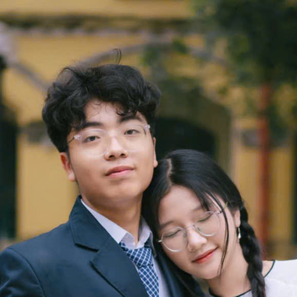

# Nguyen Hoang Bao - Portfolio Website



## 🌟 About Me

Hi! I'm **Nguyen Hoang Bao**, a high school student with a passion for computer science. I love coding, problem-solving, and learning new things. I'm interested in artificial intelligence, web development, and software engineering.

**Location:** Chu Van An High School for Gifted Students, Hanoi, Vietnam  
**Grade:** 12  
**Major:** Informatics

## 🚀 Featured Projects

### Main Projects
- **[Unity 2048 Game](https://github.com/hbaon/unity-2048)** - Extended Version of 2048 Game with enhanced features
- **[English Vocabulary App](https://github.com/hbaon/english-test-vocab)** - Comprehensive vocabulary learning for SAT, GRE, TOEFL, GMAT, CAT, IELTS
- **[Python Data Science](https://github.com/hbaon/cs404-python-ds)** - CS 404/504 Special Topics: Python Programming for Data Science

### Open Source Contributions
- **[Image Classification](https://github.com/hbaon/image-classification)** - CNN implementation for image classification
- **[Object Detection](https://github.com/hbaon/object-detection)** - YOLO model for real-time object detection
- **[Facial Recognition](https://github.com/hbaon/facial-recognition)** - OpenCV-based facial recognition system

## 🏆 Achievements

- **🥇 First Prize** - Olympiad of Informatics Grade 10 District-level Contest (2024)
- **🏅 Consolation Prize** - Northern Delta and Coastal Area Olympiad of Informatics (2024)
- **🥉 Third Prize** - Olympiad of Informatics Hanoi City-level Contest (2025)
- **🥉 Bronze Medal** - International STEM Olympiad Coding Competition (2025)
- **🥉 Bronze Medal** - International STEM Olympiad Math Competition (2025)

## 💻 Skills

### Programming Languages
- **C++** - Advanced algorithms and data structures
- **Python** - Machine learning, data science, web development
- **C#** - Unity game development
- **SQL** - Database management

### Web Development
- **HTML5** - Semantic markup and accessibility
- **CSS3** - Responsive design and animations
- **JavaScript** - Interactive web applications

### Languages
- **English** - IELTS 7.5
- **Vietnamese** - Native fluency

## 🌱 Activities & Leadership

- **Eco Purify Project** - Developed sustainable water filtration system for agriculture
- **STEMBridge Project** - Organized STEM workshops for rural schools
- **Online Courses** - CS50 Harvard, Deep Learning Specialization, Full-Stack Web Development

## 🎓 Education

- **Chu Van An High School for Gifted Students** (Current)
  - Location: Hanoi, Vietnam
  - Grade: 12
  - Major: Informatics

- **Online Learning**
  - CS50's Introduction to Computer Science (Harvard University)
  - Deep Learning Specialization (Coursera)
  - Full-Stack Web Development with React (Coursera)

## 🔗 Connect With Me

- **GitHub:** [@hbaon](https://github.com/hbaon)
- **LinkedIn:** [Nguyen Hoang Bao](https://linkedin.com/in/hbaon)
- **Email:** [your.email@example.com](mailto:your.email@example.com)

## 🛠️ Technologies Used

This portfolio website is built with:
- **HTML5** - Semantic structure
- **CSS3** - Modern styling with gradients and animations
- **Bootstrap 5** - Responsive framework
- **FontAwesome 6** - Professional icons
- **JavaScript** - Interactive features

## 📱 Features

- **Responsive Design** - Works perfectly on all devices
- **Modern UI/UX** - Clean, professional appearance
- **Smooth Animations** - Engaging user experience
- **Fast Loading** - Optimized assets and code
- **SEO Friendly** - Proper meta tags and structure

## 🚀 Getting Started

1. **Clone the repository:**
   ```bash
   git clone https://github.com/hbaon/hbaon.github.io.git
   cd hbaon.github.io
   ```

2. **Open in browser:**
   ```bash
   open index.html
   ```

3. **Or serve locally:**
   ```bash
   python -m http.server 8000
   # Then visit http://localhost:8000
   ```

## 📁 Project Structure

```
hbaon.github.io/
├── index.html          # Main portfolio page
├── style.css           # Custom styles
├── avatar.jpeg         # Profile picture
├── figures/            # Project images
├── assets/             # External libraries
│   ├── plugins/        # Bootstrap and plugins
│   └── js/            # JavaScript files
└── README.md           # This file
```

## 🤝 Contributing

This is my personal portfolio, but if you have suggestions for improvements or find any issues, feel free to:
- Open an issue
- Submit a pull request
- Contact me directly

## 📄 License

This project is open source and available under the [MIT License](LICENSE).

## 🙏 Acknowledgments

- **Chu Van An High School** for providing excellent education
- **Online learning platforms** for expanding my knowledge
- **Open source community** for inspiring my projects
- **FontAwesome** for beautiful icons
- **Bootstrap** for responsive framework

---

<div align="center">

**Made with ❤️ and lots of ☕ by Nguyen Hoang Bao**

*Last updated: September 2025*

</div>
